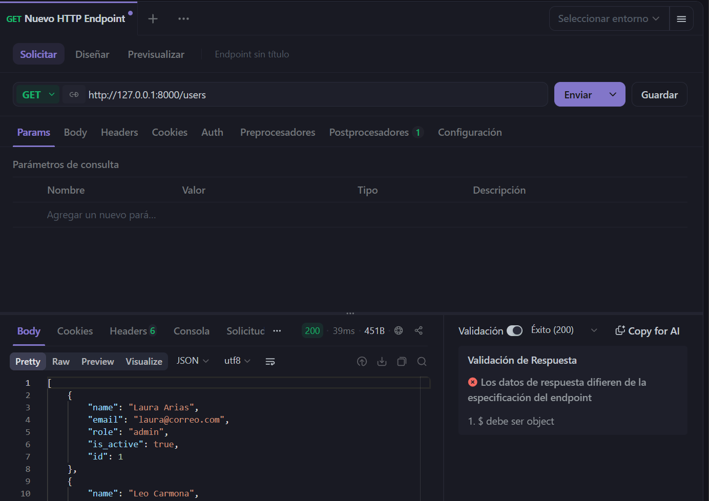
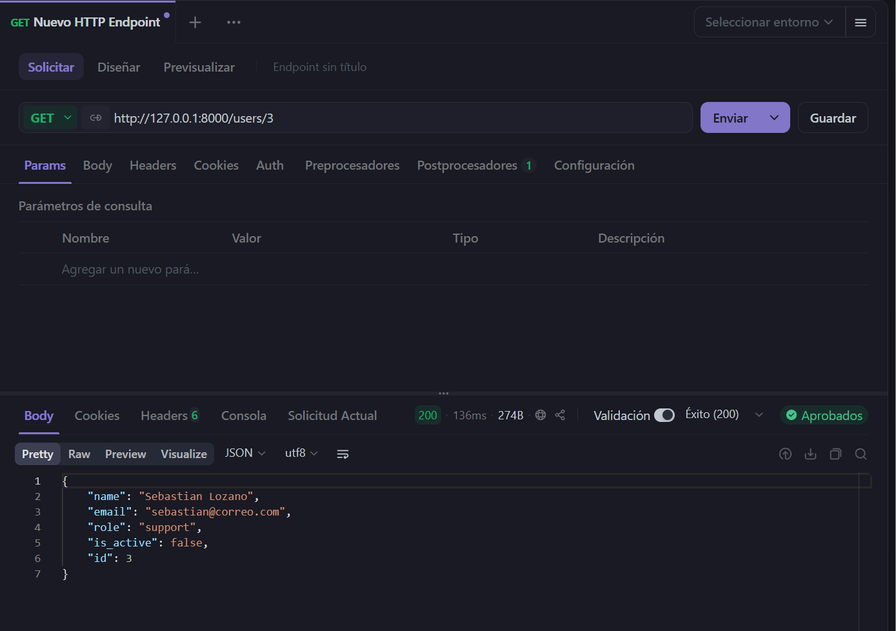
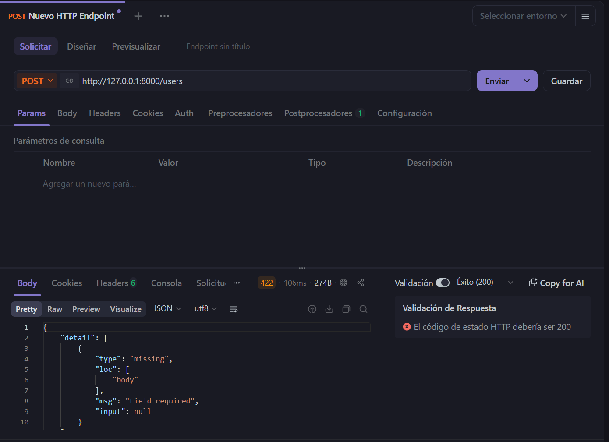
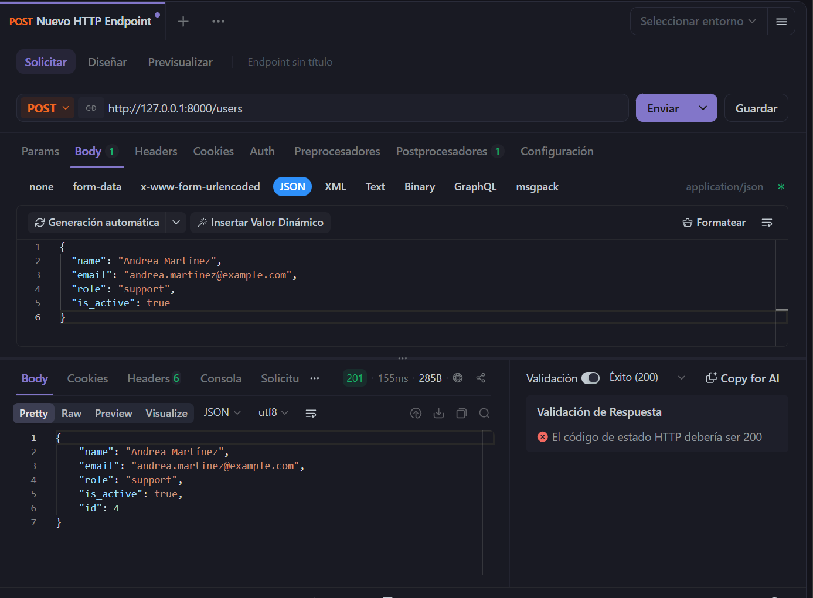

# device_systems

API REST desarrollada con **FastAPI** para la gestión de usuarios del sistema
`device_systems`. Permite listar, filtrar, consultar por ID y crear usuarios.

## Tecnologías utilizadas

- Python 3
- FastAPI
- Uvicorn (servidor ASGI)
- Pydantic (validación de datos)

## Estructura del proyecto

```
device_systems/
├── app/
│   ├── main.py                  # Punto de entrada de la aplicación FastAPI
│   ├── routes/
│   │   └── user_routes.py       # Endpoints del recurso "users"
│   └── schemas/
│       └── user_schema.py       # Modelos de datos (entrada y salida)
├── Images/                      # Capturas de pantalla usadas en este README
├── requirements.txt             # Dependencias del proyecto
└── README.md
```

## Instalación

1. Clona el repositorio y entra a la carpeta del proyecto:
   ```bash
   git clone <url-del-repositorio>
   cd device_systems
   ```

2. Crea un entorno virtual:
   ```bash
   python -m venv venv
   ```

3. Actívalo:
   - En Windows (Git Bash):
     ```bash
     source venv/Scripts/activate
     ```
   - En Windows (PowerShell):
     ```powershell
     venv\Scripts\Activate.ps1
     ```
   - En macOS / Linux:
     ```bash
     source venv/bin/activate
     ```

4. Instala las dependencias:
   ```bash
   pip install -r requirements.txt
   ```

## Ejecución

Con el entorno virtual activado, levanta el servidor de desarrollo:

```bash
uvicorn app.main:app --reload
```

El servidor quedará disponible en:

- API: http://127.0.0.1:8000
- Documentación interactiva (Apidog): http://127.0.0.1:8000/users

## Endpoints disponibles

| Método | Ruta           | Descripción                                              |
|--------|----------------|-----------------------------------------------------------|
| GET    | `/`            | Endpoint de bienvenida                                    |
| GET    | `/users`       | Lista todos los usuarios (admite filtros `role`, `is_active`) |
| GET    | `/users/{id}`  | Consulta un usuario por su ID                              |
| POST   | `/users`       | Crea un nuevo usuario                                      |

### Endpoint GET /users



### Endpoint GET /users/{id}



### Endpoint POST /users




## Autor

Laura Vanessa Henao
# Device-System
